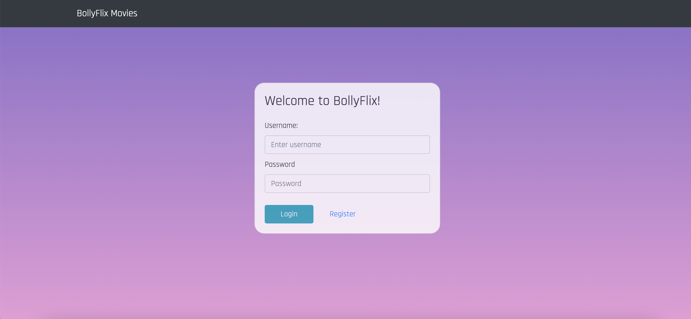
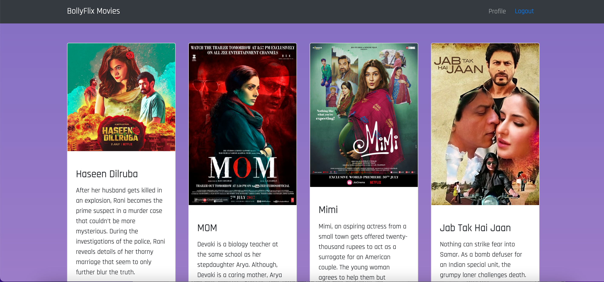

# Bollyflix Movie (API)

This is a Backend using Node/Express.js to create a REST API.
MongoDB serves as the database.


## Installation

Install dependencies for bolly-flix.movie-api with npm:

```bash
  git clone https://github.com/LeezaJee/bolly-flix.movie-api.git
  cd bolly-flix.movie-api
  npm install
  
```
    
## Documentation

### Dependencies
**For Development**
- Express Library
- Passport Library (for authentication)
- JSON Web Token and Bcrypt
- CORS
- Mongoose (Business Logic)

**For Non-Relational Database**
MongoDB / MongoDB Atlas


## Developement
### Local developement
In order to locally work on this app, you have to connect it to the localhost.
To do so, uncomment the respective code block in `index.js` and comment out the connection to the remote databasee.

### Nodemon
Once working locally, you can use Nodemon as a tool to automatically save and generate a new node file.

Start the server
```bash
npx nodemon index.js
```
After every save it restarts the server


### Hosting
- Heroku
To sync local changes to hosted db, use
```bash
git push heroku main
```

## Screenshots





## Demo

The app is hosted on Netlify.
Access it using [this]( https://bollyflix.netlify.app/) project link
